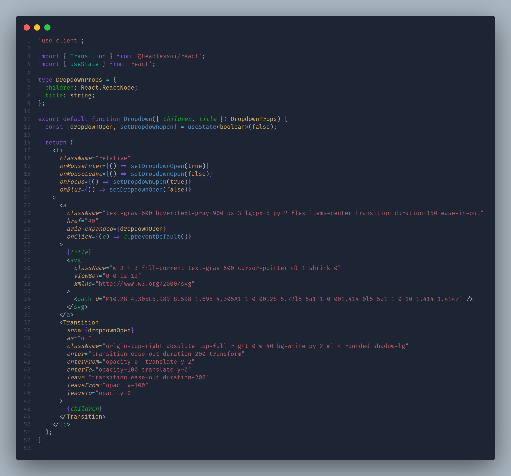
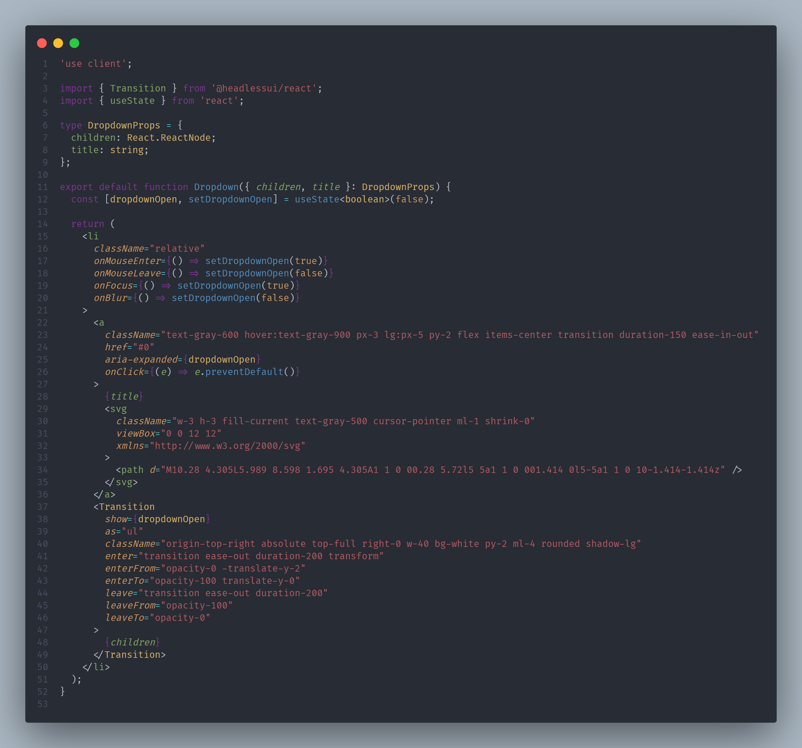

# Azalais Dark

<p align="center">
	<a href="#">
		
	</a>
</p>

# Install

<p>Go to <strong> Azalais Dark </strong> extension page at the <a href="https://marketplace.visualstudio.com/items?itemName=ChristopherAlphonse.azalais-dark-theme"> Market place </a> </i> </span>
<h5>Apply, Reload, Enjoy  </h5>
</p>

press `ctl/command + p` to launch quick open then run

```
ext install christopheralphonse.azalais-dark-theme
```

## Azalais Glow

<br/>
<p align="center">
	<a href="#">
		
	</a>
</p>
<br/>

## Azalais Classic

<p align="center">
	<a href="#">
		
	</a>
</p>
