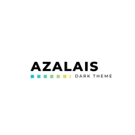

# Azalais Dark

<p align="center">
	<a href="#">
		
	</a>
</p>

<<<<<<< HEAD
## HTML

![HTML][html]
=======
<p align="center">

  

</p>

# HTML
>>>>>>> ad6b9cddadec2bb1c8a43fc827efa65ca0dbd83c

![HTML][html]

<<<<<<< HEAD
![CSS][css]
=======
# VUE
>>>>>>> ad6b9cddadec2bb1c8a43fc827efa65ca0dbd83c

![VUE][vue]

<<<<<<< HEAD
![JSON][json]

### TypeScript

![ts][ts]

### RUST

![rust][rust]
=======
# CSS
>>>>>>> ad6b9cddadec2bb1c8a43fc827efa65ca0dbd83c

![CSS][css]

<<<<<<< HEAD
![server][server]
=======
# TypeScript

![typescript][typescript]
>>>>>>> ad6b9cddadec2bb1c8a43fc827efa65ca0dbd83c

# Installation

<p>Go to <strong> Azalais Dark </strong> extension page at the <a href="https://marketplace.visualstudio.com/items?itemName=ChristopherAlphonse.azalais-dark-theme"> Market place </a> or by  <i>CTRL + SHIFT + X</i> </span>
<h5>Apply, Reload, Enjoy  </h5>
</p>

<br>
These are my personal settings for vs code aesthetics
<br>

```json
  "workbench.colorCustomizations": {
    "terminal.foreground": "#ffffff",
    "terminal.background": "#515761",
    "editor.lineHighlightBackground": "#4046452d",
    "editor.lineHighlightBorder": "#7a05701f",
    "tab.activeBackground": "#2e327195"
  },

```

```json
 "terminal.integrated.fontFamily": "MesloLGM NF",
 "workbench.iconTheme": "vscode-icons",
 "editor.fontWeight": "300"
```

```json

"workbench.colorTheme": " Azalais Dark ",
 "editor.tabSize": 3,
 "editor.fontSize": 16,
 "terminal.integrated.fontSize": 12,
 "terminal.integrated.tabs.defaultColor": "terminal.ansiCyan",
 "window.zoomLevel": 1
```

<<<<<<< HEAD
For More information visit [View here](https://github.com/ChristopherAlphonse/Powershell)

[json]: https://res.cloudinary.com/img-api-pager-2/image/upload/v1670386320/Aza%20Theme/JSON_jqqwhu.jpg
[server]: https://res.cloudinary.com/img-api-pager-2/image/upload/v1670386320/Aza%20Theme/SERVER_zayubs.jpg
[html]: https://res.cloudinary.com/img-api-pager-2/image/upload/v1670386320/Aza%20Theme/HTML_nz1mym.jpg
[ts]: https://res.cloudinary.com/img-api-pager-2/image/upload/v1670386320/Aza%20Theme/TS_wawvhn.jpg
[rust]: https://res.cloudinary.com/img-api-pager-2/image/upload/v1670386320/Aza%20Theme/RUST_edlial.jpg
[css]: https://res.cloudinary.com/img-api-pager-2/image/upload/v1670386320/Aza%20Theme/CSS_fdg0m6.jpg
=======
# Continue

Please check out [Powershell Settings](https://github.com/ChristopherAlphonse/Powershell) for more more.

[html]: ./ScreeenShots/HTML.JPG
[vue]: ./ScreeenShots/Vue.JPG
[typescript]: ./ScreeenShots/TS.JPG
[css]: ./ScreeenShots/Css.JPG
>>>>>>> ad6b9cddadec2bb1c8a43fc827efa65ca0dbd83c
