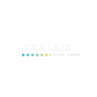

# Azalais Dark

### A theme for VS code.

  

<p align="center">
	<a href="#">
		
	</a>
</p>

# VS Code


## HTML


### CSS


### JSON


### NODE


### ENV


### React


# Installation

<p>Go to <strong> Azalais Dark </strong> extension page at the <a href="https://marketplace.visualstudio.com/items?itemName=ChristopherAlphonse.azalais-dark-theme"> Market place </a> or by  <i>CTRL + SHIFT + X</i> </span>
<h5>Apply, Reload, Enjoy  </h5>
</p>

<br>
These are my personal settings for vs code aesthetics
<br>

```json
  "workbench.colorCustomizations": {
    "terminal.foreground": "#ffffff",
    "terminal.background": "#515761",
    "editor.lineHighlightBackground": "#4046452d",
    "editor.lineHighlightBorder": "#7a05701f",
    "tab.activeBackground": "#2e327195"
  },

```

```json
 "terminal.integrated.fontFamily": "MesloLGM NF",
 "workbench.iconTheme": "vscode-icons",
 "editor.fontWeight": "300"
```

```json

"workbench.colorTheme": " Azalais Dark ",
 "editor.tabSize": 3,
 "editor.fontSize": 16,
 "terminal.integrated.fontSize": 12,
 "terminal.integrated.tabs.defaultColor": "terminal.ansiCyan",
 "window.zoomLevel": 1
```
